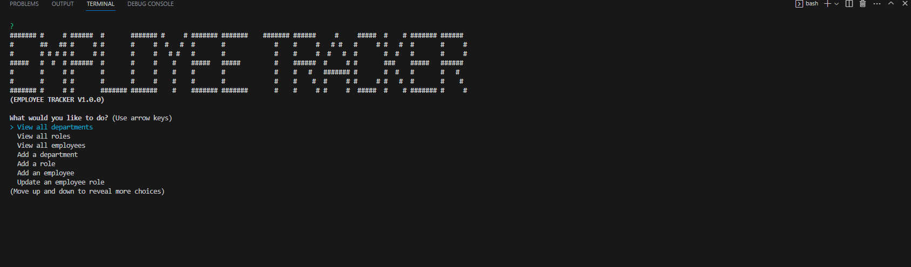

  # Employee Database Tracker

  [](https://opensource.org/licenses/MIT)

  ## Description

  Hi! Im Christopher Banta! Let me tell you a little about my project.

  ### What was my motivation for creating this project?
  
  I needed an easy application to keep all my employees info .

  ### What problem does this solve?

  This allows me to easily access my employees data and update as needed!

  ## Table of Contents

  - [Installation](#installation)
  - [Usage](#usage)
  - [License](#license)
  - [Contributing](#contributing)
  - [Tests](#tests)
  - [Questions](#questions)

  ## Installation

  Youre going to go to the GitHub repo for the project and copy the SSH git address. Once done, head to your console of choice and enter the folder you want the project to be installed in. After that type git clone <repo name> and it will install the application to your destination. Open the file in VSCode and open the integrated terminal. Type ```nmp i``` to install all required packages, you will also need to have MySql installed. You will run mysql in the integrated console with ```mysql -u root -p``` and then enter your password. From there you can ```SOURCE db/schema.sql``` and ```SOURCE db/seed.sql``` to get the database started. Once all that is complete quit mysql and run ```node index.js``` to launch the application.

  ## Usage

  Click on the desired result from the list the application gives you and follow the on screen instructions!

  
  [Video of Application in action](https://drive.google.com/file/d/141MYjED5MC_Wc6DGQboZzpiw1QUEAKcI/view)
  
  ## License

[](https://opensource.org/licenses/MIT)

This project is covered under the MIT License license.

  ## Contributing

  For help with the table format I used stack overflow here: https://stackoverflow.com/a/67859384

  ## Tests

  N/A

  ## Questions

  For any questions or further inquiries feel free to contact me at either of the following:
  
  Github: [BantaChristopher](https://github.com/BantaChristopher)

  Email: <chris.banta@rocketmail.com>

  